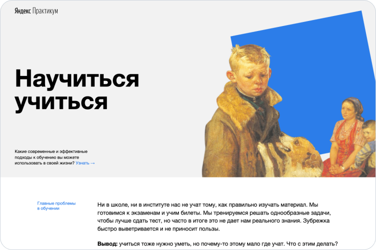

# How To Learn

**How To Learn** —1 это первый одностраничный сайт в моем портфолио, сделанный в рамках двух спринтов в [Яндекс.Практикуме](https://praktikum.yandex.ru/).

    

### Что снаружи

Основной посыл данного сайта — указать на проблемы, возникающие при обучении и подсказать технологии, которые помогут вам эффективно с ними справляться.

Вы узнаете про пять практик от Барбары Оакли (а также кое-что из ее биографии), направленными на управление вниманием, памятью, а также узнаете, почему вопрос уже содержит в себе часть ответа, а термин *Интерливинг* перестанет казаться для вас таким страшным и непонятным.

Видео с TED познакомят вас с *прокрастинацей* — причиной того, почему я пишу этот текст в последние дни дедлайна и в 4 часа ночи.

Кроме того, вы найдете удивительные факты о работе человеческого мозга и готовые принципы обучения от Джоша Кауфмана.

Ну и конечно, вас ждет захватывающее продолжение пути в мир обучения — ссылки на полезные ресурсы и книгу, которую рекомендует сам автор "Звездных Войн"!

### Что внутри

Какие технологии были использованы:
  - Методология БЭМ для классов и организации файлов
  - CSS анимации
  - FlexBox
  - Псевдоклассы
  - Git

### Что было самым сложным

Во время разработки некоторые вещи заняли у меня гораздо больше времени, чем я ожидал. Я выписал их, чтобы акцентировать свое внимание на них после сдачи проекта:
  - Как обрезать изображения, вложенные в div без `object-fit`.
  - `q` vs `blockquote`.
  - Как грамотно указывать `margin` для секций в рамках БЭМ.
  - Как расположить третью и последнюю карточку в блоке techniques без псеводкассов.
  - Какие именно символы нужно заменять на "Сharacter codes for the HTML".

### Планы на будущее

1. **Сделать сайт адаптивным.**
2. **Задизайнить форму, через которую пользователи смогут отправить мне комментарий.**
2. Добавить все значения для атрибута `href` у ссылок.
3. Персонализировать copyright в footer, чтобы при нажатии на него оно полностью менялось с *Geo* на *Георгий Горчев*, используя псеводклассы и `content` (если это возможно, конечно).
4. **Проверить код на кроссбраузерность и дописать все вендорные префиксы.**
5. Подключить другие шрифты.

